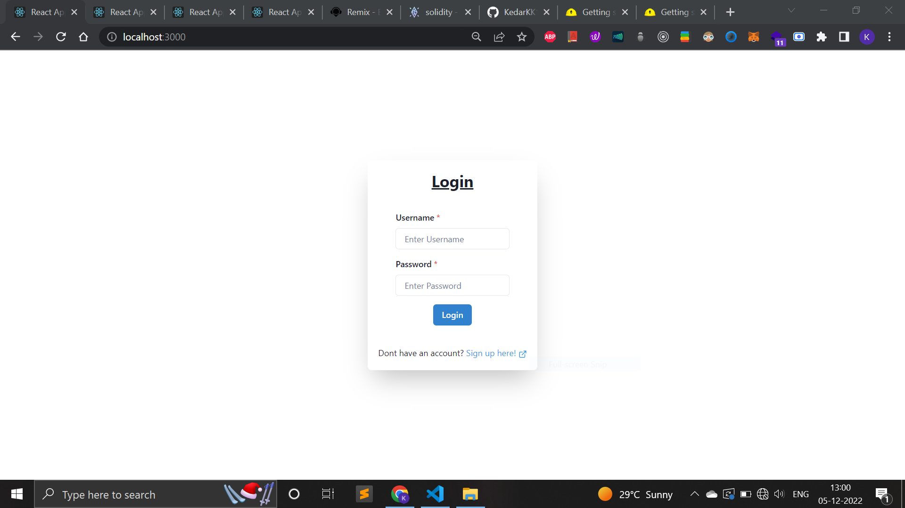
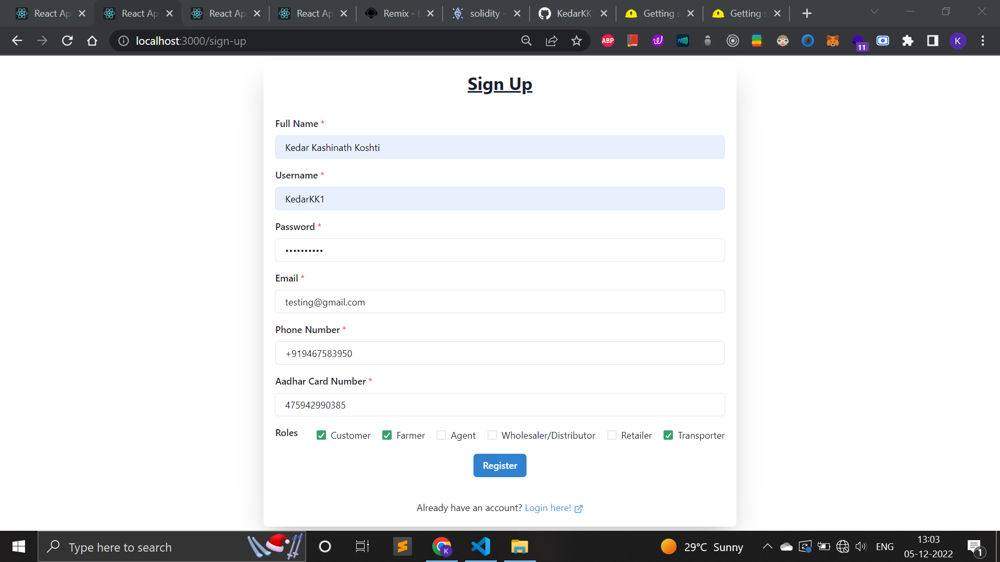
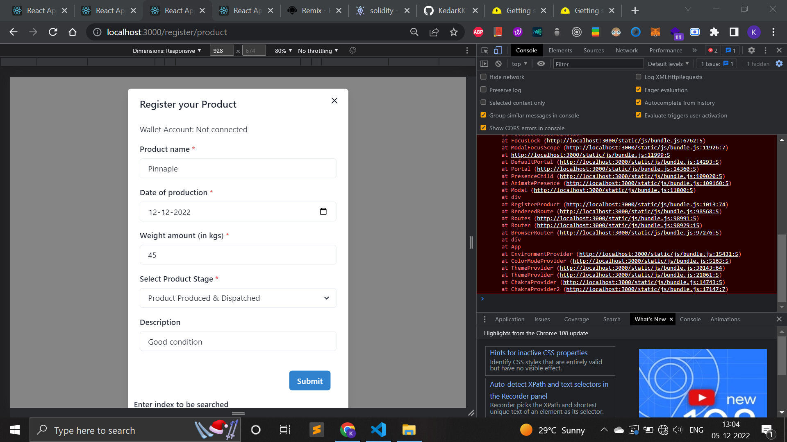
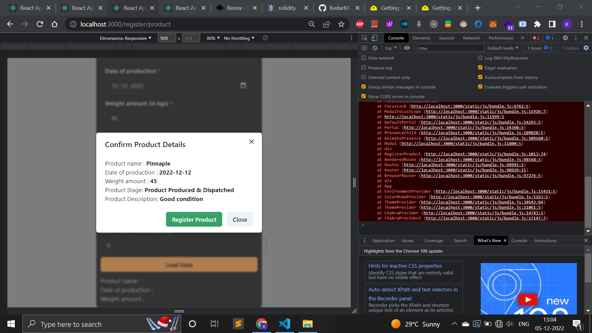
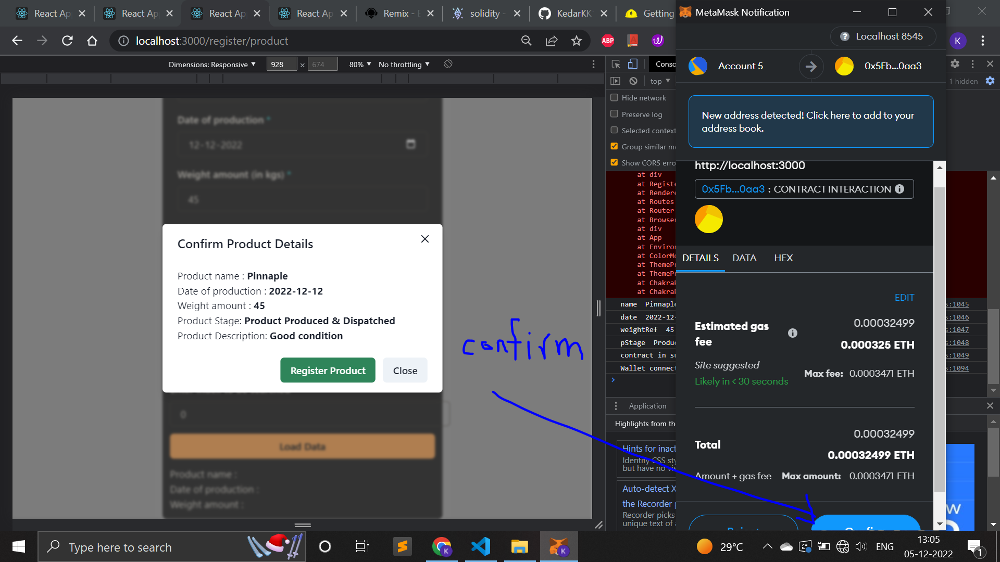
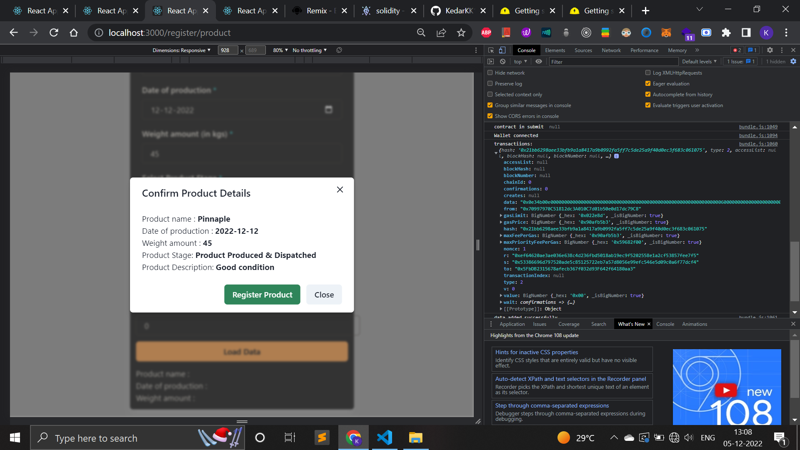
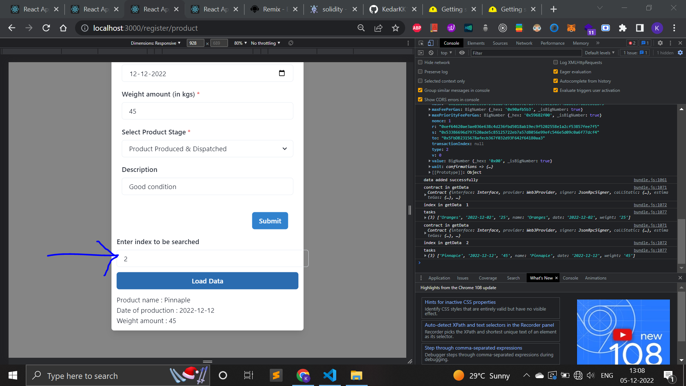
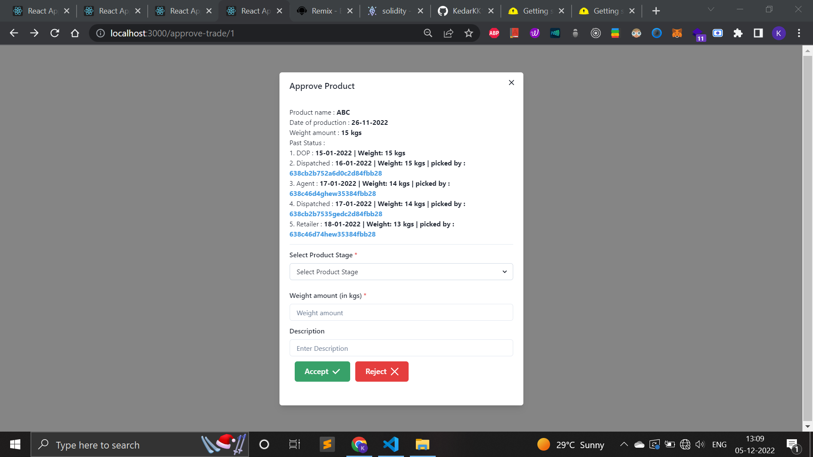
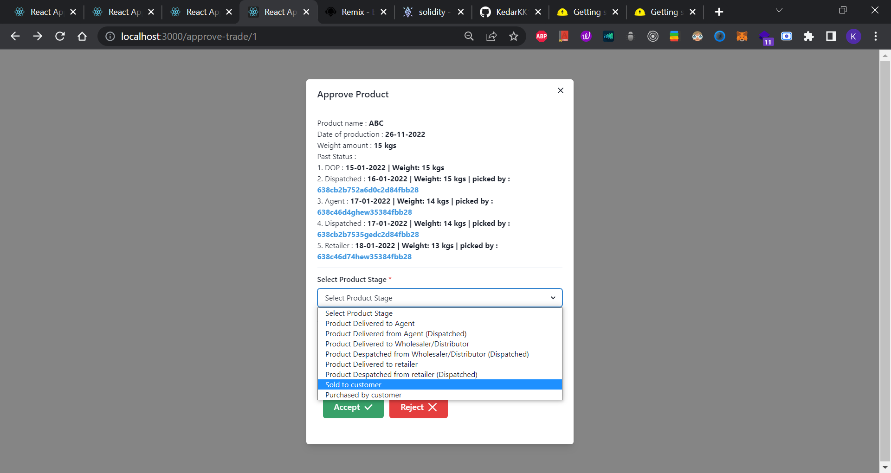
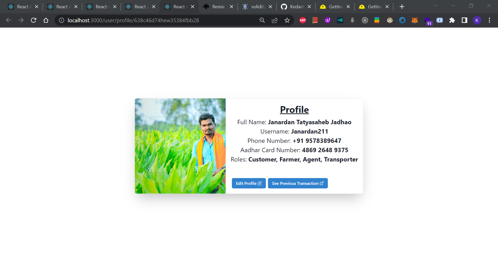

# For running this project =>

```
Step 1) in one terminal => npx hardhat compile
Step 1) in one terminal => npx hardhat node
Step 2) Copy one of the Private Keys and change your metamask acc. using Metamask -> My Account (round icon of icon) -> Click on Import Account ->  Enter Private Keys there -> then make sure metamask account (now it will have 1000 ethers) is connected
Step 3) In another terminal, enter npx hardhat run scripts/deploy.js --network localhost -> then Copy the blockchain id there "Scm with 1 ETH and unlock timestamp 1701757029 deployed to 0x5FbDB2315678afecb367f032d93F642f64180aa3" copy the last part(0x5FbDB2315678afecb367f032d93F642f64180aa3)
Step 4) In pages/RegisterProduct.js add const contractAddress = "0x5FbDB2315678afecb367f032d93F642f64180aa3";
Step 5) Then in another terminal, npm start -> then go to frontend link http://localhost:3000/register/product -> add details click on submit then add data then confirm gas fees through etherium account(testnet on blockchain network we deployed)
Step 6) Click on index on data(1,2,3,4,5....) for getting the data
Step 7) Similarly go to link http://localhost:3000/approve-trade/1 to add intermediary(transporter/agent/retailer/distributor/etc etc) after which will add a new transaction by adding current production stage, status, weight, date, etc in case of transaction accepted else add it to auction/selling, user's id will be added to the block, which is open to all

```

# Screenshots











# Sample Hardhat Project

This project demonstrates a basic Hardhat use case. It comes with a sample contract, a test for that contract, and a script that deploys that contract.

Try running some of the following tasks:

```shell
npx hardhat help
npx hardhat test
REPORT_GAS=true npx hardhat test
npx hardhat node
npx hardhat run scripts/deploy.js
npx hardhat node
npx hardhat run scripts/deploy.js --network localhost
```

## Show your support

Give a ⭐️ if this project helped you! <br/>
Make sure to credit me in the Footer, if you do end up using it!